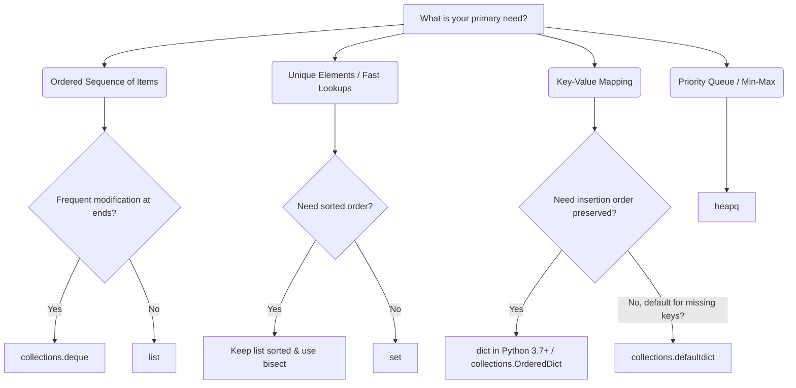

# 🐍 Python DSA Libraries and Collections Reference

Welcome to the **Python DSA Libraries and Collections** guide! This resource covers standard Python data structures and library modules essential for solving Data Structures and Algorithms (DSA) problems efficiently.

---

## 🚀 Time Complexity Cheat Sheet

Below is a reference table for the time complexities of various operations across Python's collections.

| Data Structure / Module | Operation | Average Case | Worst Case | Notes / Internal Implementation |
| :--- | :--- | :--- | :--- | :--- |
| **`list`** (Dynamic Array) | Append / Pop last | $O(1)$ | $O(1)$ amortized | Fast insertion/deletion at end. |
| | Insert / Delete (index) | $O(n)$ | $O(n)$ | Requires shifting elements. |
| | Lookup by index (`lst[i]`) | $O(1)$ | $O(1)$ | Direct memory addressing. |
| | Search by value (`val in lst`) | $O(n)$ | $O(n)$ | Linear scan. |
| | Slice / Copy (`lst[i:j]`) | $O(k)$ | $O(k)$ | $k$ is slice length. |
| **`set`** (Hash Set) | Add / Remove | $O(1)$ | $O(n)$ | Implemented as a hash table. |
| | Lookup (`val in s`) | $O(1)$ | $O(n)$ | Fast membership test. |
| **`dict`** (Hash Map) | Insert / Delete key | $O(1)$ | $O(n)$ | Implemented as a hash table. |
| | Lookup key (`dct[key]`) | $O(1)$ | $O(n)$ | $O(n)$ is extremely rare (collision storm). |
| **`collections.deque`** | Append / Pop (left or right) | $O(1)$ | $O(1)$ | Doubly linked list blocks. Fast Stack/Queue. |
| | Lookup by index | $O(n)$ | $O(n)$ | Slow random access. Use `list` instead. |
| **`heapq`** (Min-Heap) | Heapify (`heapify(lst)`) | $O(n)$ | $O(n)$ | In-place linear conversion. |
| | Push (`heappush(h, x)`) | $O(\log n)$ | $O(\log n)$ | Up-heap bubble. |
| | Pop (`heappop(h)`) | $O(\log n)$ | $O(\log n)$ | Down-heap bubble. |
| | Push-pop (`heappushpop`) | $O(\log n)$ | $O(\log n)$ | More efficient than separate push + pop. |
| **`bisect`** (Binary Search) | Search index (`bisect_left`) | $O(\log n)$ | $O(\log n)$ | Works only on sorted lists. |
| | Insert into sorted (`insort`) | $O(n)$ | $O(n)$ | $O(\log n)$ search, but $O(n)$ list shift. |

---

## 🛠️ Selection Guide: Which Data Structure to Use?

Use this decision matrix when solving DSA problems to select the right collection:

---

## 📂 Navigation Table of Contents

Explore each topic in-depth:

1. 📦 **[Built-in Types](built_in_types.md)** - Lists, Tuples, Sets, and Dictionaries.
2. 🧳 **[Collections Module](collections_module.md)** - `deque`, `Counter`, `defaultdict`, `OrderedDict`, and `namedtuple`.
3. 📐 **[Heapq and Bisect Modules](heapq_and_bisect.md)** - Min-heaps, max-heaps, and binary searching.
4. 🧠 **[Practice Problems & Solutions](problems/)**:
   * [Valid Parentheses (Stack using Deque)](problems/valid_parentheses.py)
   * [Top K Frequent Elements (Counter + Heapq)](problems/top_k_frequent.py)
   * [First and Last Position of Element in Sorted Array (Bisect)](problems/first_last_position.py)
   * [LRU Cache (OrderedDict)](problems/lru_cache.py)
